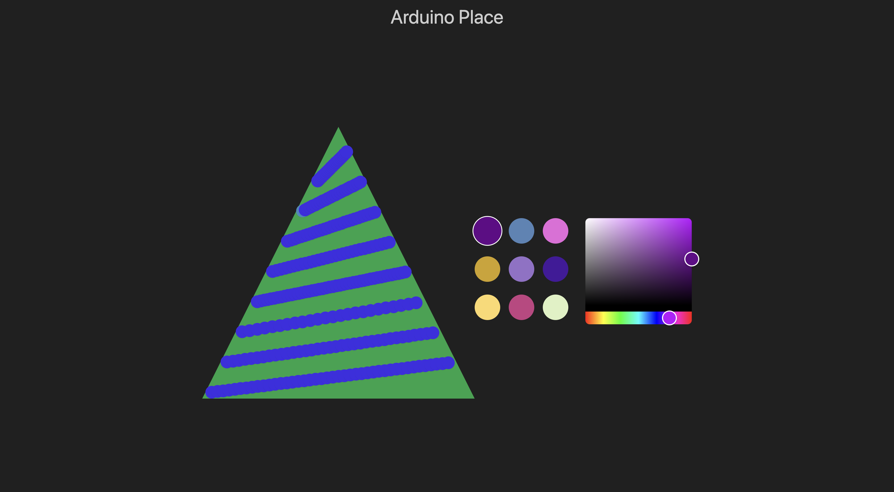

# Arduino Place SPA



Single page application for controlling the leds on the tree.

## Running

### Locally

```bash
pnpm install & pnpm dev
```

- Note the base url of the API is currently hardcoded.

### Deployed

This application is served via the [backend application](../arduino-place-server/) under. At the moment, deploying this means running

```bash
pnpm build
```

Then copying and pasting the contents of `dist` into [static](../arduino-place-server/static/). In the fututre could be optimized by a build command.
